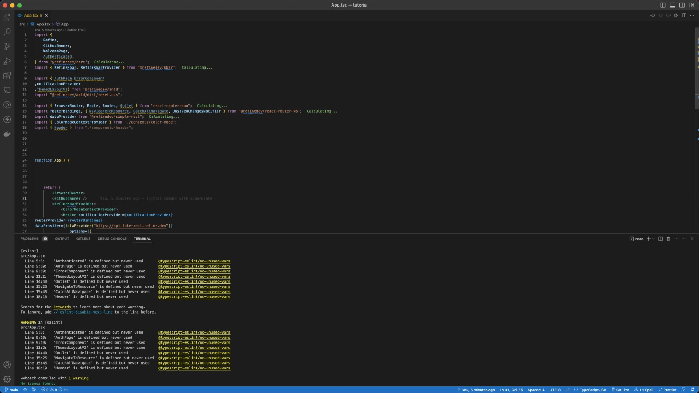

# tutorial

<div align="center" style="margin: 30px;">
    <a href="https://refine.dev">
    
    </a>
</div>
<br/>

This [refine](https://github.com/pankod/refine) project was generated with [superplate](https://github.com/pankod/refine).

## Getting Started

**refine** is a React-based framework for building data-intensive applications in no time ✨

Refine offers lots of out-of-the box functionality for rapid development, without compromising extreme customizability. Use-cases include, but are not limited to admin panels, B2B applications and dashboards.

## Available Scripts

### Running the development server.

```bash
    npm run dev
```

### Building for production.

```bash
    npm run build
```

### Running the production server.

```bash
    npm run start
```

## Learn More

To learn more about **refine**, please check out the [Documentation](https://refine.dev/docs)

- **Ant Design** [Docs](https://refine.dev/docs/ui-frameworks/antd/tutorial/)
- **React Router** [Docs](https://refine.dev/docs/core/providers/router-provider/)
- **REST Data Provider** [Docs](https://refine.dev/docs/core/providers/data-provider/#overview)

## Notes When Trying refine.dev

1. Node Code Linting
   When first start to clone the project, the code is absolute mess, especially in indentation (no Javascript standard)
   

2. Multiple request
   When first time to came to specific page, query hit multiple times. And if data have `unique value` refine will hit it.
   

3. Not Recommended to use auto generated CRUD in production environment
   Refine told us to actually don't use auto generated CRUD by Inferencer feature, because backend data structure will be different in the future (FE will need customize, map, or maybe mutate the value it-self in the client side).
   

4. Object inside the response will be represented as [Relationship](https://refine.dev/docs/tutorial/adding-crud-pages/headless/index/#handling-relationships)
   if theres any object inside response, will be say as Relationship, just like SQL. And it's make client call API multiple API request to the server. This is related to note number 3.

## License

MIT
